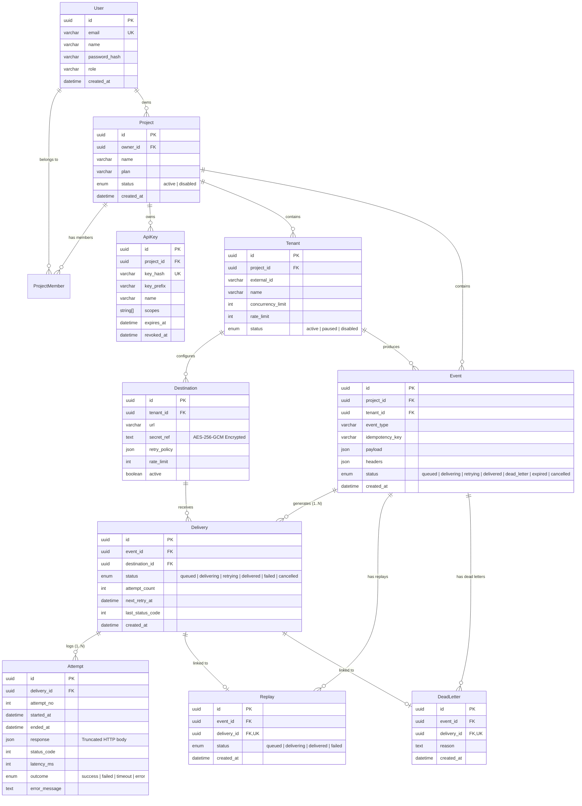
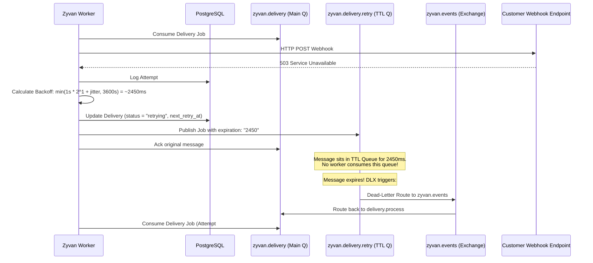

# Zyvan — Comprehensive Codebase Analysis & Technical Architecture

> **Document Version:** 1.0.0  
> **Date:** September 2026  
> **Repository:** `zyvan`  
> **Project Type:** Distributed Multi-Tenant Webhook & Event Delivery Infrastructure Monorepo

---

## 📑 Table of Contents

1. [Executive Summary](#1-executive-summary)
2. [High-Level System Architecture](#2-high-level-system-architecture)
3. [Complete Technology Stack Matrix](#3-complete-technology-stack-matrix)
4. [Monorepo Workspace & Directory Structure](#4-monorepo-workspace--directory-structure)
5. [Database Schema & Data Model Deep Dive](#5-database-schema--data-model-deep-dive)
6. [Core Ingestion & Asynchronous Delivery Pipeline](#6-core-ingestion--asynchronous-delivery-pipeline)
7. [Cryptographic Security & Anti-SSRF Defense](#7-cryptographic-security--anti-ssrf-defense)
8. [Dead-Letter Queue (DLQ) & Immutable Replay Engine](#8-dead-letter-queue-dlq--immutable-replay-engine)
9. [API Architecture & REST Endpoint Directory](#9-api-architecture--rest-endpoint-directory)
10. [Frontend Architecture, Dashboard & MDX Documentation Engine](#10-frontend-architecture-dashboard--mdx-documentation-engine)
11. [Infrastructure, DevOps & Deployment Topology](#11-infrastructure-devops--deployment-topology)
12. [Testing, Quality Assurance & Verification Suite](#12-testing-quality-assurance--verification-suite)
13. [Key Engineering Innovations & Architectural Decisions](#13-key-engineering-innovations--architectural-decisions)

---

## 1. Executive Summary

**Zyvan** is an enterprise-grade, high-throughput, distributed event ingestion and reliable webhook delivery platform designed to guarantee **at-least-once delivery** for multi-tenant SaaS environments.

### Core Problems Solved
- **Zero Event Loss Under Failure:** Utilizes PostgreSQL as a durable transactional system of record before enqueuing execution messages to RabbitMQ.
- **Strict Idempotency & Deduplication:** Composite database unique constraints (`project_id`, `idempotency_key`) prevent duplicate event executions caused by upstream retries and network flakiness.
- **Polling-Free Retries with RabbitMQ TTL + DLX:** Retries are delayed via RabbitMQ per-message Time-To-Live (TTL) and Dead Letter Exchange (DLX) routing, eliminating database polling and CPU overhead.
- **Noisy-Neighbor Mitigation:** Tenant-level rate limits and concurrency caps prevent one high-volume customer from starving shared worker capacity.
- **End-to-End Cryptographic Security:** Signing secrets are symmetrically encrypted at rest using **AES-256-GCM**. Outbound webhooks include timestamped **HMAC-SHA256** signatures (`Zyvan-Signature: t=...,v1=...`).
- **Comprehensive SSRF Defense:** Real-time DNS resolution and CIDR filtering block requests to private subnets (RFC 1918), loopback, link-local, and cloud metadata endpoints (`169.254.169.254`).
- **Audit-Preserving Replays:** Retrying or replaying dead-lettered events creates fresh execution lineages without mutating historical delivery attempts.

---

## 2. High-Level System Architecture

```
                               ┌────────────────────────────────────────┐
                               │   Customer App / Webhook Producer     │
                               └───────────────────┬────────────────────┘
                                                   │ HTTP POST /v1/events
                                                   │ [Bearer API Key / JWT]
                                                   ▼
                               ┌────────────────────────────────────────┐
                               │               Zyvan API                │
                               │          (Express.js Service)          │
                               │  - Request ID & Logging Middleware     │
                               │  - Zod Schema Validation               │
                               │  - Auth & Scope Verification           │
                               │  - In-Memory / DB Idempotency Guard    │
                               └──────────────┬──────────────────┬──────┘
                                              │                  │
                         1. Commit Transaction│                  │ 2. Publish Job
                         (Event + Deliveries) │                  │ (After Commit)
                                              ▼                  ▼
                               ┌───────────────────────┐  ┌───────────────────────┐
                               │      PostgreSQL       │  │       RabbitMQ        │
                               │   (System of Record)  │  │   (Execution Broker)  │
                               │  - events             │  │  - zyvan.events (X)   │
                               │  - deliveries         │  │  - zyvan.delivery (Q) │
                               │  - attempts           │  │  - zyvan.delivery.    │
                               │  - dead_letters       │  │    retry (DLX Q)      │
                               └───────────────────────┘  └───────────┬───────────┘
                                                                      │
                                                                      │ Consume Prefetched Job
                                                                      ▼
                               ┌──────────────────────────────────────────────────┐
                               │                   Zyvan Worker                   │
                               │  1. Fetch Event + Destination Record             │
                               │  2. Decrypt Secret (AES-256-GCM)                 │
                               │  3. Sign Payload (HMAC-SHA256)                   │
                               │  4. Validate URL & DNS against SSRF              │
                               │  5. HTTP POST to Destination URL                 │
                               │  6. Insert Immutable Attempt Record              │
                               └──────────────┬──────────────────┬────────────────┘
                                              │                  │
                          HTTP 2xx (Success)  │                  │ HTTP 5xx / Timeout / 429
                                              ▼                  ▼
                                     ┌────────────────┐  ┌────────────────────────────────┐
                                     │ Mark Delivered │  │ Exponential Backoff Calculator │
                                     │  (PostgreSQL)  │  │ min(base*2^att + jitter, max)  │
                                     └────────────────┘  └───────────────┬────────────────┘
                                                                         │
                                                   ┌─────────────────────┴─────────────────────┐
                                                   │                                           │
                                       Attempt < Max Retries                       Attempt >= Max Retries
                                                   │                               (or Terminal 4xx)
                                                   ▼                                           │
                                      ┌────────────────────────┐                               ▼
                                      │ Publish to Retry Queue │                    ┌────────────────────┐
                                      │ with TTL Expiration    │                    │ Move to DLQ Record │
                                      │ (DLX routes to Main Q) │                    │ & Mark Failed      │
                                      └────────────────────────┘                    └──────────┬─────────┘
                                                                                               │
                                                                                    Dashboard Manual Replay
                                                                                    (Fresh Lineage Created)
```

---

## 3. Complete Technology Stack Matrix

| Category | Technology | Version | Purpose & Usage in Codebase |
| :--- | :--- | :--- | :--- |
| **Runtime & Language** | **Node.js** | `>=20.0.0` | Server runtime for API, Worker, and Web services |
| | **TypeScript** | `5.7.x` | Strict type-safety across all packages and apps |
| **Backend Framework** | **Express.js** | `4.21.x` | High-performance HTTP ingestion engine & REST API |
| | **Helmet** | `8.0.x` | HTTP security headers |
| | **CORS** | `2.8.x` | Cross-origin resource sharing configuration |
| | **Compression** | `1.8.x` | Gzip compression for API payloads |
| | **Pino & Pino-Pretty**| `9.6.x` | Structured, high-throughput JSON logging with secret redaction |
| **Frontend Framework**| **Next.js** | `16.3.4` | App Router, React Server Components (RSC), SSR, and API routes |
| | **React** | `19.2.8` | UI Component library |
| | **React DOM** | `19.2.8` | DOM rendering for React 19 |
| **Styling & UI** | **TailwindCSS** | `v4.x` | Modern CSS styling with PostCSS plugin |
| | **Motion (Framer)** | `13.2.x` | Fluid UI animations, landing page micro-interactions |
| | **Lucide React** | `1.43.x` | Core UI icons |
| | **Hugeicons React** | `1.1.x` | Extended icon set for dashboard and docs |
| | **clsx & tailwind-merge**| `2.1.x / 3.6.x` | Conditional and conflict-free className composition |
| **Documentation** | **next-mdx-remote** | `6.0.0` | Server-rendered dynamic MDX documentation |
| | **gray-matter** | `4.0.3` | YAML frontmatter parsing for documentation pages |
| | **remark-gfm** | `4.0.1` | GitHub Flavored Markdown support (tables, checklists, alerts) |
| | **Mermaid.js** | `11.17.2` | Interactive client-side architectural diagram rendering |
| **Database & ORM** | **PostgreSQL** | `16-alpine` | ACID-compliant relational system of record |
| | **Prisma Client & CLI**| `5.22.x` | Type-safe ORM, migrations, schema modeling, and client generation |
| **Message Broker** | **RabbitMQ** | `3.13-management` | AMQP broker for asynchronous delivery and delayed retry queues |
| | **amqplib** | `0.10.5` | Node.js AMQP client for channel, queue, and exchange management |
| **In-Memory Cache** | **Redis** | `7-alpine` | Session management, auxiliary caching, and distributed locks |
| **Validation** | **Zod** | `3.24.x` | Runtime schema validation for requests, configs, and payloads |
| **Cryptography** | **Node.js `crypto`**| Native | `aes-256-gcm`, `hmac-sha256`, `timingSafeEqual`, `randomBytes` |
| | **bcryptjs / jsonwebtoken**| `3.0.x / 9.0.x` | Password hashing and session JWT issuing/verifying |
| **DevOps & Containers**| **Docker & Compose**| Multi-stage | Containerization for PostgreSQL, Redis, RabbitMQ, API, Worker, Web |
| **Testing** | **Jest** | `29.7.x` | Test runner and assertion library |
| | **ts-jest** | `29.2.x` | TypeScript execution for Jest |
| | **Supertest** | `7.0.x` | HTTP integration testing for Express endpoints |

---

## 4. Monorepo Workspace & Directory Structure

Zyvan uses **npm workspaces** to manage internal dependencies between libraries and services.

```
zyvan/
├── apps/
│   ├── api/                          # Express.js REST API & Ingestion Engine
│   │   ├── src/
│   │   │   ├── __tests__/            # API Unit & Integration test suites
│   │   │   ├── config/               # Environment variable validation (Zod)
│   │   │   ├── lib/                  # RabbitMQ publisher & Pino logger
│   │   │   ├── middleware/           # Auth, Request ID, Error Handling
│   │   │   ├── modules/              # Domain-driven feature modules
│   │   │   │   ├── api-keys/         # API Key generation, listing, revocation
│   │   │   │   ├── auth/             # User signup, login, session JWT, demo
│   │   │   │   ├── bootstrap/        # First-run admin initialization
│   │   │   │   ├── deliveries/       # Delivery query and attempt inspector
│   │   │   │   ├── destinations/     # Webhook destination CRUD & secret config
│   │   │   │   ├── dlq/              # Dead Letter Queue queries & resolution
│   │   │   │   ├── events/           # Event ingestion, deduplication, listing
│   │   │   │   ├── projects/         # Project isolation boundary management
│   │   │   │   ├── replay/           # Audit-preserving event replay
│   │   │   │   ├── tenants/          # Multi-tenant rate & concurrency limits
│   │   │   │   └── usage/            # Aggregated metrics & latency percentiles
│   │   │   ├── routes/               # Health and root routes
│   │   │   └── app.ts                # Express application bootstrapping & shutdown
│   │   ├── Dockerfile                # Production multi-stage Docker build
│   │   ├── package.json
│   │   └── tsconfig.json
│   │
│   ├── worker/                       # Webhook Delivery Worker Service
│   │   ├── src/
│   │   │   ├── __tests__/            # Worker retry and backoff unit tests
│   │   │   ├── lib/                  # RabbitMQ consumer channel & topology
│   │   │   ├── services/
│   │   │   │   ├── attempt-service.ts# Immutable attempt recorder
│   │   │   │   ├── delivery-service.ts# Core delivery pipeline & state machine
│   │   │   │   ├── http-client.ts    # Outbound HTTP POST with signing & SSRF
│   │   │   │   └── retry-service.ts  # Exponential backoff + full jitter logic
│   │   │   └── worker.ts             # Consumer loop, prefetch, graceful shutdown
│   │   ├── Dockerfile
│   │   ├── package.json
│   │   └── tsconfig.json
│   │
│   └── web/                          # Next.js 16 Dashboard, Simulator & Docs
│       ├── content/docs/             # MDX Documentation source files
│       │   ├── api-reference/        # Endpoint docs (Events, DLQ, Tenants, etc.)
│       │   ├── architecture/         # System design, DB ER models, DLX workers
│       │   ├── core-concepts/        # Idempotency, Projects, Deliveries
│       │   ├── getting-started/      # Quickstarts, local setup, production
│       │   ├── guides/               # Signature verification, replay playbooks
│       │   ├── sdks/                 # TypeScript/Node, Python, Go guides
│       │   └── webhooks/             # Webhook best practices & DLQ recovery
│       ├── public/                   # Static assets, icons, manifest
│       ├── src/
│       │   ├── app/                  # Next.js App Router
│       │   │   ├── api/              # Internal proxy / helper routes
│       │   │   ├── dashboard/        # Authenticated developer dashboard
│       │   │   │   ├── api-keys/     # API Key management UI
│       │   │   │   ├── destinations/ # Webhook destination configuration UI
│       │   │   │   ├── dlq/          # Dead Letter Queue inspector & replay UI
│       │   │   │   ├── events/       # Live event stream & attempt timelines
│       │   │   │   ├── settings/     # Project & tenant settings UI
│       │   │   │   ├── simulator/    # Live interactive webhook testing lab
│       │   │   │   ├── layout.tsx    # Dashboard sidebar, project switcher, auth
│       │   │   │   └── page.tsx      # Metrics overview, P50/P95/P99 latency
│       │   │   ├── docs/             # Dynamic MDX documentation reader
│       │   │   ├── login/            # User authentication & demo login
│       │   │   ├── signup/           # User registration
│       │   │   ├── layout.tsx        # Root HTML layout & font declarations
│       │   │   └── page.tsx          # Marketing landing page
│       │   ├── components/           # UI components (Hero, Features, Bento, etc.)
│       │   │   ├── dashboard/        # Dashboard widgets & charts
│       │   │   ├── docs/             # MDX components, CommandPalette, Toc
│       │   │   └── ui/               # Buttons, dialogs, badges, inputs
│       │   └── lib/                  # API client, Auth Context, MDX compiler
│       ├── Dockerfile
│       ├── package.json
│       └── tsconfig.json
│
├── packages/
│   ├── crypto/                       # Cryptographic & Security Utilities
│   │   ├── src/
│   │   │   ├── __tests__/            # Encryption & HMAC signature tests
│   │   │   ├── api-key.ts            # Key generator (`zyvan_live_...`) & SHA-256
│   │   │   ├── encryption.ts         # AES-256-GCM encrypt/decrypt with auth tag
│   │   │   ├── hmac.ts               # Timestamped HMAC-SHA256 signer & verifier
│   │   │   ├── ssrf.ts               # DNS resolution & private IP range filter
│   │   │   └── index.ts              # Package entry point
│   │   ├── package.json
│   │   └── tsconfig.json
│   │
│   ├── database/                     # Prisma ORM & Database Layer
│   │   ├── prisma/
│   │   │   ├── schema.prisma         # Complete PostgreSQL schema (9 models)
│   │   │   └── seed.ts               # Dev/Demo seed script
│   │   ├── src/
│   │   │   └── index.ts              # Prisma singleton & disconnect handlers
│   │   ├── package.json
│   │   └── tsconfig.json
│   │
│   └── schemas/                      # Shared Zod Validation Schemas
│       ├── src/
│       │   └── index.ts              # Schemas for Events, Keys, Tenants, etc.
│       ├── package.json
│       └── tsconfig.json
│
├── docker-compose.yml                # Local dev services (Postgres, Redis, RabbitMQ)
├── docker-compose.prod.yml           # Production multi-service orchestration
├── DEPLOYMENT_AWS.md                 # Complete AWS EC2 & ECS Fargate deployment guide
├── package.json                      # Root workspace scripts & orchestration
├── tsconfig.json                     # Monorepo root TypeScript configuration
└── README.md                         # Project overview & quickstart guide
```

---

## 5. Database Schema & Data Model Deep Dive

The database architecture is designed with **PostgreSQL 16** as the single source of truth. All critical states are persisted before any asynchronous message is queued.



### Key Schema Constraints & Indexes
1. **Idempotency Guard:** `@@unique([projectId, idempotencyKey])` on `Event`. Guarantees that even under concurrent race conditions across multiple API instances, duplicate events cannot be inserted.
2. **Tenant Scoping:** `@@unique([projectId, externalId])` on `Tenant`. Allows clients to use their internal IDs (e.g. `cust_123`) safely partitioned per project.
3. **Optimized Query Indices:**
   - `Event`: `[projectId]`, `[tenantId]`, `[eventType]`, `[status]`, `[createdAt]`
   - `Delivery`: `[eventId]`, `[destinationId]`, `[status]`, `[nextRetryAt]`
   - `Attempt`: `[deliveryId]`
   - `DeadLetter`: `[eventId]`, `[deliveryId]` (Unique)

---

## 6. Core Ingestion & Asynchronous Delivery Pipeline

### 6.1 Event Ingestion Workflow (Transactional Outbox Pattern)

When an upstream service sends an event:
1. **Authentication:** The `authenticate` middleware parses the `Authorization: Bearer <key>` header, compares the peppered SHA-256 hash against the `api_keys` table, and verifies required scopes (`events:write`).
2. **Tenant Validation:** Resolves tenant by `external_id` within the authenticated `project_id`. Confirms tenant status is `active`.
3. **Idempotency Check:**
   - Performs a fast database lookup for `(project_id, idempotency_key)`.
   - If found: immediately returns the existing event with `{ duplicate: true, status: ... }` and HTTP 200/202 without creating new delivery jobs.
4. **Atomic Transaction:**
   - Finds all active `Destination` records for the tenant.
   - Inserts 1 `Event` record.
   - Inserts $N$ `Delivery` records (one per active destination) with status `queued`.
   - If a race condition occurs, Prisma catches code `P2002` and falls back to returning the existing record cleanly.
5. **Broker Dispatch:**
   - Only **after** the PostgreSQL transaction commits successfully, the API publishes delivery jobs to RabbitMQ topic exchange `zyvan.events` with routing key `delivery.process`.
   - Even if RabbitMQ is momentarily unreachable, the event is safely recorded in PostgreSQL and can be recovered.

### 6.2 Worker Execution & Delivery Lifecycle

The worker runs a continuous, non-blocking consumer on `zyvan.delivery`:

1. **Job Consumption:** Reads `{ deliveryId, eventId }` with manual message acknowledgments (`noAck: false`) and a concurrency prefetch limit (`WORKER_PREFETCH=5`).
2. **State & Boundary Validation:**
   - Queries PostgreSQL for the `Delivery`, `Event`, `Destination`, and `Tenant`.
   - Discards stale/already delivered jobs (`ack`).
   - If destination or tenant is paused, issues a `nack` with requeue (`requeue: true`) to wait for resumption.
3. **Execution & Auditing:**
   - Updates `Delivery.status = delivering` and increments `attemptCount`.
   - Inserts a new `Attempt` record (`started_at = now()`).
   - Decrypts the destination's `secretRef` using AES-256-GCM.
   - Signs the raw payload with HMAC-SHA256 and sets header `Zyvan-Signature: t={timestamp},v1={hex_sig}`.
   - Executes DNS resolution to verify destination IP safety against SSRF.
   - Dispatches the HTTP POST request with a 30-second timeout.
4. **Attempt Completion:**
   - Captures HTTP status code, latency (ms), outcome, error message, and truncated response body (up to 4KB).
   - Writes the completed `Attempt` record into PostgreSQL.

### 6.3 RabbitMQ TTL + DLX Delayed Retry Mechanism

Unlike traditional systems that poll the database every few seconds (e.g. `SELECT * FROM deliveries WHERE next_retry_at <= NOW()`), Zyvan offloads retry scheduling to RabbitMQ:



**Exponential Backoff Formula:**
$$\text{Delay} = \min\left(\text{baseDelay} \times 2^{(\text{attempt} - 1)} + \text{jitter},\ \text{maxDelay}\right)$$
Where:
- $\text{baseDelay}$ defaults to 1 second
- $\text{jitter} = \text{random}(0, \text{baseDelay})$ (Full Jitter prevents thundering herds)
- $\text{maxDelay}$ defaults to 3600 seconds (1 hour)

---

## 7. Cryptographic Security & Anti-SSRF Defense

Zyvan includes a dedicated, zero-dependency cryptographic engine located in `packages/crypto`.

### 7.1 Symmetric Secret Encryption (AES-256-GCM)
- Webhook signing secrets are never stored in plaintext.
- **Algorithm:** `aes-256-gcm`
- **Key:** 256-bit (32 bytes hex-encoded, configured via `ENCRYPTION_KEY`)
- **Initialization Vector (IV):** 16 cryptographically secure random bytes generated per encryption.
- **Authentication Tag:** 16-byte GCM tag verifying payload integrity and authenticity.
- **Storage Format:** `base64( IV [16B] + Ciphertext [NB] + Tag [16B] )`

### 7.2 Webhook Signature Specification (HMAC-SHA256)
Outbound deliveries include headers for verification and replay protection:
```http
POST /webhook HTTP/1.1
Host: api.customer.com
Content-Type: application/json
User-Agent: Zyvan-Webhook/0.1.0
X-Zyvan-Delivery: c4b8f601-38a2-4a7b-b3f9-710e97d19762
X-Zyvan-Event: a1f92e8c-5721-4f1b-a912-fec811234981
X-Zyvan-Signature: v1=f7bc83f430538424b13298e6aa6fb143ef4d59a14946175997479dbc2d1a3cd8
X-Zyvan-Timestamp: 1726132195
```

**Signing Algorithm:**
$$\text{Signature} = \text{HMAC-SHA256}_{\text{secret}}\left(\text{timestamp} + \text{"."} + \text{raw\_payload}\right)$$

**Verification Flow:**
1. Extract timestamp and signature header.
2. Check if $| \text{current\_time} - \text{timestamp} | \le 300\text{ seconds}$ (5-minute tolerance against replay attacks).
3. Compute expected signature over `timestamp + "." + raw_payload`.
4. Perform constant-time comparison via `crypto.timingSafeEqual` to prevent side-channel timing attacks.

### 7.3 Anti-SSRF (Server-Side Request Forgery) Protection
Before opening an outbound HTTP connection, `validateUrl` performs strict multi-tier validation:
1. **Protocol Restriction:** Enforces `https://` in production environments.
2. **Hostname Blacklist:** Blocks `localhost`, `localhost.localdomain`, `metadata.google.internal`, `metadata.google`, `instance-data`.
3. **DNS Resolution & IP Inspection:**
   - Performs a DNS A-record resolution via `dns.resolve4`.
   - Checks **all** resolved IP addresses against blocked CIDR ranges:
     - `127.0.0.0/8` (Loopback)
     - `10.0.0.0/8` (Private Class A)
     - `172.16.0.0/12` (Private Class B: `172.16.x.x` – `172.31.x.x`)
     - `192.168.0.0/16` (Private Class C)
     - `169.254.0.0/16` (Link-Local & AWS/GCP/Azure Instance Metadata `169.254.169.254`)
     - `0.0.0.0`, `255.255.255.255`, and IPv6 `::1`

---

## 8. Dead-Letter Queue (DLQ) & Immutable Replay Engine

### 8.1 Dead-Letter Queue (DLQ) Mechanics
A delivery is moved to the DLQ under two conditions:
1. **Terminal 4xx Responses:** Non-retryable HTTP responses (e.g., `400 Bad Request`, `401 Unauthorized`, `404 Not Found`) bypass retries and enter DLQ immediately. `429 Too Many Requests` is treated as retryable.
2. **Exhausted Retries:** When `attemptCount >= maxAttempts` without receiving a 2xx success.

**DLQ Transaction:**
- `Delivery.status` set to `failed`.
- `DeadLetter` record inserted containing `eventId`, `deliveryId`, and failure reason.
- `Event.status` set to `dead_letter`.

### 8.2 Immutable Replay Engine
A critical requirement in enterprise financial and compliance environments is **audit trail immutability**. Replaying a failed event must never overwrite or delete previous failure logs.

**How Zyvan Replay Works:**
1. Upstream requests a replay via `POST /v1/events/:eventId/replay` (optionally specifying a specific `destination_id`).
2. Inside an ACID transaction:
   - Historical `Attempt` records and old `Delivery` records remain untouched.
   - A **brand new** `Delivery` record is created (`status = queued`, `attempt_count = 0`).
   - A `Replay` record is created linking `eventId` and the new `deliveryId`.
   - `Event.status` is reset to `queued`.
3. The new delivery job is enqueued to RabbitMQ for immediate worker processing.

---

## 9. API Architecture & REST Endpoint Directory

All endpoints (except health, bootstrap, and auth) require authentication via `Authorization: Bearer <token>` or dashboard session JWT.

### Route Catalog

| Method | Endpoint | Description | Auth Required |
| :--- | :--- | :--- | :--- |
| **Health** | `GET /` | Root health check | None |
| | `GET /health` | Health status and uptime | None |
| | `GET /ready` | Readiness check (DB & RabbitMQ health) | None |
| | `GET /live` | Liveness probe | None |
| **Auth** | `POST /v1/auth/signup` | Register new user and project | None |
| | `POST /v1/auth/login` | Login and retrieve session JWT | None |
| | `POST /v1/auth/demo` | Instant 1-click demo login | None |
| | `GET /v1/auth/me` | Current user context & active project | Bearer / JWT |
| **Bootstrap** | `POST /v1/bootstrap` | Initial admin setup (only on fresh DB) | None |
| **Projects** | `GET /v1/projects` | List projects owned by user | Bearer / JWT |
| | `POST /v1/projects` | Create new project | Bearer / JWT |
| | `GET /v1/projects/:id` | Get project details | Bearer / JWT |
| | `PATCH /v1/projects/:id` | Update project name/plan/status | Bearer / JWT |
| **API Keys** | `GET /v1/api-keys` | List API keys for active project | Bearer / JWT |
| | `POST /v1/api-keys` | Generate new API key (`zyvan_live_...`) | Bearer / JWT |
| | `DELETE /v1/api-keys/:id`| Revoke API key | Bearer / JWT |
| **Tenants** | `GET /v1/tenants` | List project tenants with rate limits | Bearer / JWT |
| | `POST /v1/tenants` | Register tenant with concurrency limits| Bearer / JWT |
| | `GET /v1/tenants/:id` | Get tenant by ID or external_id | Bearer / JWT |
| | `PATCH /v1/tenants/:id` | Update tenant status or limits | Bearer / JWT |
| **Destinations**| `GET /v1/destinations` | List webhook destinations | Bearer / JWT |
| | `POST /v1/destinations` | Create destination with encrypted secret| Bearer / JWT |
| | `GET /v1/destinations/:id`| Get destination config | Bearer / JWT |
| | `PATCH /v1/destinations/:id`| Update destination URL/retry policy | Bearer / JWT |
| | `DELETE /v1/destinations/:id`| Delete destination | Bearer / JWT |
| **Events** | `POST /v1/events` | **Ingest event** (Idempotent webhook trigger) | Bearer / JWT |
| | `GET /v1/events` | List events with cursor pagination | Bearer / JWT |
| | `GET /v1/events/:id` | Get event with full delivery & attempt graph | Bearer / JWT |
| **Deliveries**| `GET /v1/destinations/:id/deliveries` | List deliveries for a destination | Bearer / JWT |
| | `GET /v1/events/:id/deliveries` | List all deliveries for an event | Bearer / JWT |
| **DLQ** | `GET /v1/dead-letters` | List dead-lettered deliveries | Bearer / JWT |
| | `GET /v1/dead-letters/:id`| Get DLQ item details with error logs | Bearer / JWT |
| **Replay** | `POST /v1/events/:id/replay` | Replay event (Creates new attempt lineage)| Bearer / JWT |
| **Usage** | `GET /v1/usage/metrics` | Latency percentiles (P50/P95/P99) & rates | Bearer / JWT |
| | `GET /v1/usage/stats` | Aggregated delivery counters | Bearer / JWT |

---

## 10. Frontend Architecture, Dashboard & MDX Documentation Engine

The `apps/web` application is built on **Next.js 16.3** with React 19 and TailwindCSS v4.

### 10.1 Key Frontend Features
1. **Interactive Landing Page (`/`):**
   - Live architectural pipeline interactive animation.
   - Interactive webhook simulator allowing developers to test payloads and responses in real-time.
   - Dynamic pricing calculator, feature bento grids, and quickstart code snippet switcher.
2. **Developer Dashboard (`/dashboard`):**
   - **Real-Time Delivery Metrics:** Visual cards rendering total events, delivery success rate (e.g. 99.8%), active destinations, and DLQ size.
   - **Latency Percentile Graphs:** P50, P95, and P99 latency tracking.
   - **Event Inspector (`/dashboard/events`):** Filter by status, event type, date range; view full request payload, headers, and individual attempt timelines.
   - **Dead-Letter Queue Manager (`/dashboard/dlq`):** Inspect failed payloads, error stack traces, and execute one-click replays.
   - **Destination Manager (`/dashboard/destinations`):** Configure URLs, generate AES-256-GCM signing secrets, and customize retry backoff rules.
   - **API Key Manager (`/dashboard/api-keys`):** Create scoped keys and copy them once during generation.
   - **Testing Simulator (`/dashboard/simulator`):** Mock incoming webhooks and test destination response handling directly inside the UI.

### 10.2 Custom MDX Documentation Portal (`/docs`)
The documentation system is statically compiled and dynamically rendered using `next-mdx-remote` and `gray-matter`.

- **Directory:** `apps/web/content/docs`
- **Supported MDX Components:**
  - `<CardGroup>` and `<Card>`: Visual navigational cards with icons.
  - `<CodeGroup>`: Tabbed multi-language code snippets (Node.js, Python, Go, cURL).
  - `<ParamField>`: Interactive API parameter descriptions with data types, requirements, and default values.
  - `<Callout>`: Alert boxes for `note`, `tip`, `warning`, `danger`.
  - `<EndpointBadge>`: Visual REST method pills (`POST`, `GET`, `PATCH`, `DELETE`).
  - `<MermaidDiagram>`: Dynamic client-rendered Mermaid architecture charts.
- **Global Command Palette (`Cmd+K`):** Full-text fuzzy search across all documentation sections, API endpoints, and guides.

---

## 11. Infrastructure, DevOps & Deployment Topology

### 11.1 Local Development Environment (Docker Compose)
A single command brings up the required persistence and message broker infrastructure:

```bash
docker-compose up -d
```

- **PostgreSQL 16:** Port `5432` (User: `zyvan`, DB: `zyvan_dev`)
- **Redis 7:** Port `6379`
- **RabbitMQ 3.13:** Port `5672` (AMQP) & `15672` (Management Dashboard)

### 11.2 Production Multi-Service Compose (`docker-compose.prod.yml`)
Runs all 5 services with production resource limits, automated healthchecks, and persistent volume mounts:
1. `postgres` (PostgreSQL 16 Alpine)
2. `redis` (Redis 7 Alpine)
3. `rabbitmq` (RabbitMQ 3.13 Management Alpine)
4. `api` (Zyvan Express API, multi-stage Node 20 build)
5. `worker` (Zyvan Webhook Delivery Worker)
6. `web` (Next.js 16 Production Standalone Server)

### 11.3 AWS Deployment Profiles (Detailed in `DEPLOYMENT_AWS.md`)
- **Option A: AWS EC2 (Single-Host Production):**
  - EC2 instance (`t4g.medium` or `t3.medium`) running Docker Compose.
  - Nginx reverse proxy managing SSL termination via Let's Encrypt / Certbot.
  - Automated database backup scripts to Amazon S3.
- **Option B: AWS ECS Fargate + Managed Cloud Services:**
  - Compute: AWS ECS Fargate tasks for `api`, `worker`, and `web`.
  - Database: Amazon RDS for PostgreSQL (Multi-AZ).
  - Queue: Amazon MQ for RabbitMQ.
  - Load Balancer: AWS Application Load Balancer (ALB) with ACM TLS certificates.

---

## 12. Testing, Quality Assurance & Verification Suite

Zyvan enforces testing across all monorepo workspaces using Jest and Supertest.

```bash
# Run all workspace test suites
npm test

# Run specific package tests
npm run test:unit --workspace=apps/api
npm run test:unit --workspace=apps/worker
npm run test --workspace=packages/crypto
```

### Test Coverage Areas
1. **`packages/crypto` Tests:**
   - AES-256-GCM encryption and decryption integrity.
   - HMAC-SHA256 signature calculation, versioning, and verification.
   - Timing-safe equality and replay attack prevention (timestamp tolerance).
   - SSRF validator blocking private IPs, cloud metadata, and loopbacks.
   - API Key hashing and prefix generation.
2. **`apps/api` Tests:**
   - Health check endpoints (`/health`, `/ready`, `/live`).
   - Authentication middleware (Bearer API keys, User JWT sessions, expired keys).
   - Zod schema validation for all event, tenant, and destination payloads.
   - Standard error handler status formatting and request ID propagation.
3. **`apps/worker` Tests:**
   - Exponential backoff calculation and jitter bounds.
   - Classification of retryable (5xx, timeouts, 429) vs terminal (4xx) errors.
   - Retry policy parsing and default fallbacks.

---

## 13. Key Engineering Innovations & Architectural Decisions

### 1. Why PostgreSQL is the System of Record (Over Queue-Only Architectures)
Many webhook dispatchers publish directly to a message broker on receipt. If the broker is overloaded or experiences a network partition, events are permanently lost. Zyvan stores the event and delivery intent in PostgreSQL **first**. RabbitMQ functions strictly as an ephemeral execution layer; the database remains the immutable source of truth.

### 2. RabbitMQ TTL + DLX Over Database Polling
Traditional webhook engines run cron jobs or `setInterval` database queries to find retries (`SELECT * FROM deliveries WHERE next_retry_at <= NOW() FOR UPDATE SKIP LOCKED`). At scale, this causes severe index bloat and database CPU exhaustion. Zyvan offloads delayed scheduling to RabbitMQ's message expiration and Dead Letter Exchanges, achieving zero database polling overhead.

### 3. Separation of `Event` and `Delivery`
A single event (e.g. `order.created`) may fan out to multiple subscriber destinations (e.g., Inventory, Analytics, Billing). Modeling `Event` separately from `Delivery` allows independent retry schedules, independent failure statuses, and granular observability per destination.

### 4. Noisy-Neighbor Tenant Isolation
In multi-tenant SaaS platforms, one customer triggering 100,000 webhooks in a batch could monopolize worker pools, delaying other customers' critical deliveries. Zyvan implements per-tenant concurrency limits (`concurrency_limit`) and throughput rate limits (`rate_limit`) to enforce fair resource distribution.

### 5. Constant-Time HMAC Signature Verification
String equality (`===`) short-circuits on the first mismatched byte, exposing webhook signature verification to timing attacks. Zyvan mandates `crypto.timingSafeEqual` with strict timestamp tolerance checking to ensure enterprise cryptographic safety.

---

## 📄 License

MIT License. Copyright (c) 2026 Zyvan.
