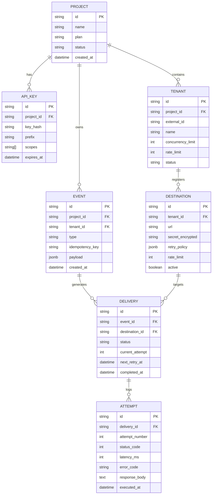

# Database & Entity-Relationship Models

Zyvan uses **PostgreSQL 16** via **Prisma ORM** as its authoritative system of record.

---

## Entity-Relationship (ER) Diagram



---

## Critical Indices & Unique Constraints

1. **Idempotency Uniqueness**:
   ```sql
   CREATE UNIQUE INDEX idx_events_project_idempotency 
   ON events (project_id, idempotency_key);
   ```
2. **Delivery Status Querying**:
   ```sql
   CREATE INDEX idx_deliveries_destination_status 
   ON deliveries (destination_id, status);
   ```
3. **Attempt Log Partitioning**:
   ```sql
   CREATE INDEX idx_attempts_delivery_created 
   ON attempts (delivery_id, executed_at DESC);
   ```
