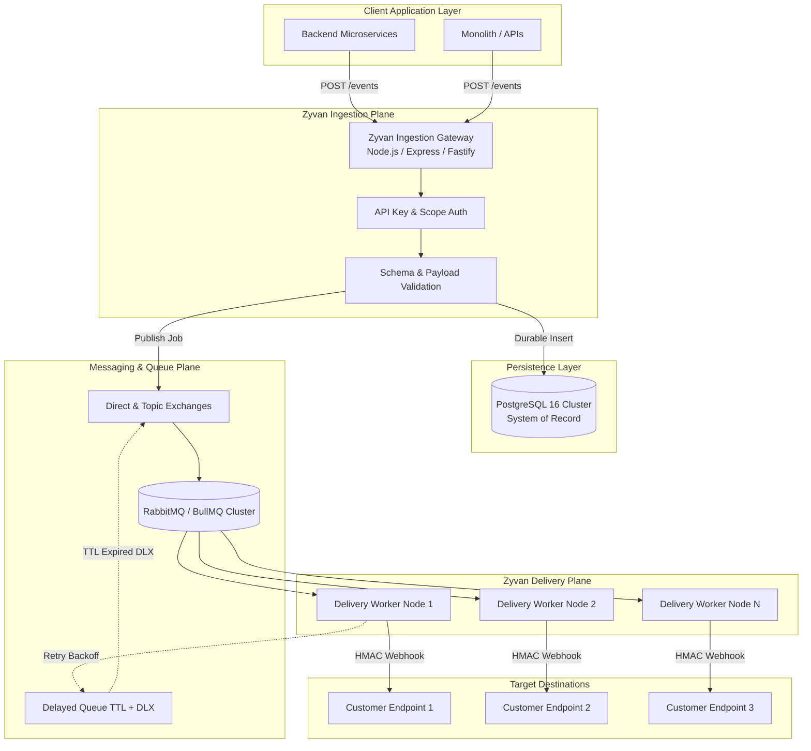

# System Architecture Overview

Zyvan is designed with a **distributed, decoupled topology** where fast HTTP ingest operations never depend on the availability or latency of downstream webhook endpoints.

---

## High-Level Topology

---

## Component Responsibilities

| Subsystem | Technology | Responsibility | SLA / Latency |
| :--- | :--- | :--- | :--- |
| **Ingestion Plane** | Node.js, TypeScript, Fastify/Express | Validates auth, enforces rate limits, checks idempotency, persists to PostgreSQL, and publishes to queue. | $< 25$ ms |
| **System of Record** | PostgreSQL 16 (Prisma ORM) | Stores events, projects, tenants, encrypted secrets, deliveries, and physical attempt logs. | 99.999% Durability |
| **Message Broker** | RabbitMQ / BullMQ | Coordinates delivery tasks, dead letter exchanges, and scheduled delays without DB polling. | High Throughput |
| **Delivery Plane** | Node.js Worker Fleet | Executes HTTP requests, signs HMAC payloads, handles retries with jitter, logs latency, and manages circuit breaking. | Autoscaling |
| **DLQ & Recovery** | Zyvan Replay Engine | Quarantines permanently failed deliveries and coordinates manual/bulk replays without state overwrites. | Zero Data Loss |

<Callout type="tip" title="Stateless Workers">
  Delivery worker processes are entirely stateless. They can be dynamically scaled up or down using Kubernetes HPA or ECS based on queue depth metrics.
</Callout>
