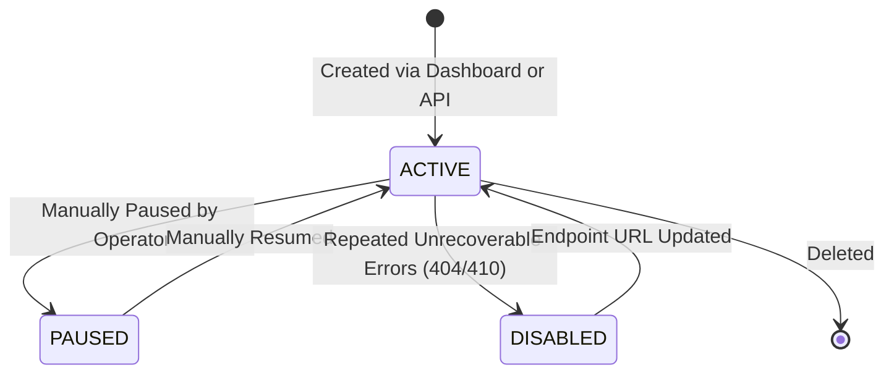

# Destinations and Endpoints

A **Destination** is a registered HTTP(S) endpoint configured in Zyvan to receive webhook payloads when specific event types are published.

Destinations define where webhooks are delivered, how they are cryptographically signed, and what retry policies apply when downstream endpoints experience outages.

---

## Destination Lifecycle States



- **`ACTIVE`**: The destination actively receives all matching events.
- **`PAUSED`**: Event matching continues, but deliveries are held in queue and not dispatched over the network. Useful during planned customer maintenance windows.
- **`DISABLED`**: Zyvan automatically disables destinations that return persistent `404 Not Found` or `410 Gone` across 50 consecutive deliveries, preventing wasted network capacity.

---

## Configuration Schema

When registering a destination via the SDK or REST API, you configure the following parameters:

| Field | Type | Required | Default | Description |
| :--- | :--- | :--- | :--- | :--- |
| `url` | `string` | **Yes** | — | Public HTTPS URL where `POST` requests are delivered. |
| `description` | `string?` | No | `null` | Human-readable label (e.g., "Production Stripe Webhooks"). |
| `event_types` | `string[]` | No | `["*"]` | Subscribed event types (supports wildcards like `order.*`). |
| `secret` | `string?` | No | Auto-gen | Shared secret used to sign HMAC-SHA256 headers (`whsec_...`). |
| `rate_limit` | `number` | No | `100` | Max requests per second dispatched to this endpoint. |
| `retry_policy` | `object` | No | Default | Custom exponential backoff parameters. |

---

## Cryptographic Signing Secrets

Every destination possesses a dedicated signing secret prefixed with `whsec_`.

```text
whsec_99f2e718b5c90a12e34f8a7b6c5d4e3f2a1b0c9d8e7f6a5b4c3d2e1f0a9b8c7
```

### Encryption at Rest (AES-256-GCM)

Signing secrets are never stored in plaintext within the Zyvan database:
1. When a secret is generated or updated, Zyvan generates a unique 96-bit Initialization Vector (IV).
2. The secret is encrypted using **AES-256-GCM** (Galois/Counter Mode) authenticated encryption.
3. The ciphertext, initialization vector, and 128-bit authentication tag are committed to PostgreSQL.
4. Plaintext secrets are decrypted in worker memory only for the millisecond required to compute the HMAC signature.

<Callout type="security" title="Zero-Knowledge Secret Storage">
  Zyvan operators, database backups, and SQL query logs never expose raw signing secrets. In the dashboard, secrets are masked after initial generation.
</Callout>

---

## SSRF (Server-Side Request Forgery) Defense

Because webhooks require dispatching HTTP requests to user-provided URLs, webhook engines are prime targets for SSRF attacks aiming to probe internal VPC infrastructure or cloud metadata services.

Zyvan implements defense-in-depth protection before every network socket connection:

<Steps>
  <Step number={1} title="Strict Protocol Enforcement">
    Only `https://` URLs are accepted in production environments. Plain `http://` is strictly prohibited unless `NODE_ENV=development` targeting `localhost`.
  </Step>

  <Step number={2} title="Private IP & Metadata Blocklist">
    Zyvan resolves the destination domain via DNS and verifies that the resulting IP address does not fall within reserved ranges:
    - `127.0.0.0/8` (Loopback)
    - `10.0.0.0/8`, `172.16.0.0/12`, `192.168.0.0/16` (Private RFC 1918)
    - `169.254.169.254` & `fd00::/8` (AWS/GCP/Azure Instance Metadata)
    - `0.0.0.0/8`, `100.64.0.0/10`, `198.18.0.0/15` (Carrier-grade NAT & benchmark ranges)
  </Step>

  <Step number={3} title="DNS Rebinding Prevention (Socket Pinning)">
    Attackers often configure DNS records that resolve to a public IP during initial validation, then switch to `169.254.169.254` milliseconds later.
    
    Zyvan prevents DNS rebinding by performing DNS resolution first, validating the IP, and **pinning the outgoing TCP connection directly to the verified IP**, bypassing subsequent DNS lookups during request dispatch.
  </Step>

  <Step number={4} title="Strict Port Whitelist">
    Outgoing connections are strictly restricted to port `443` (HTTPS) and port `80` (local HTTP test mode only). All other ports (e.g. `22`, `3306`, `5432`, `6379`, `8080`) are blocked at the transport layer.
  </Step>
</Steps>

---

## Custom Retry Policies

You can customize retry policies per destination to match downstream capabilities:

```typescript
import { ZyvanClient } from '@zyvan/sdk';

const zyvan = new ZyvanClient({
  apiKey: process.env.ZYVAN_API_KEY!,
  projectId: 'prj_live_01H8X92M4Q',
});

// Configure destination with custom retry policy
const destination = await zyvan.destinations.create({
  url: 'https://api.customer.com/webhooks',
  description: 'Customer Billing Webhook',
  eventTypes: ['payment.*', 'invoice.*'],
  retryPolicy: {
    maxAttempts: 7,           // Maximum attempts before DLQ (default: 5)
    initialIntervalSec: 10,   // Delay before 2nd attempt (default: 5s)
    backoffMultiplier: 2.5,   // Exponential multiplier (default: 2.0)
    maxIntervalSec: 43200,    // 12-hour maximum retry interval ceiling
  },
  rateLimit: 50,              // 50 requests / second ceiling
});
```
