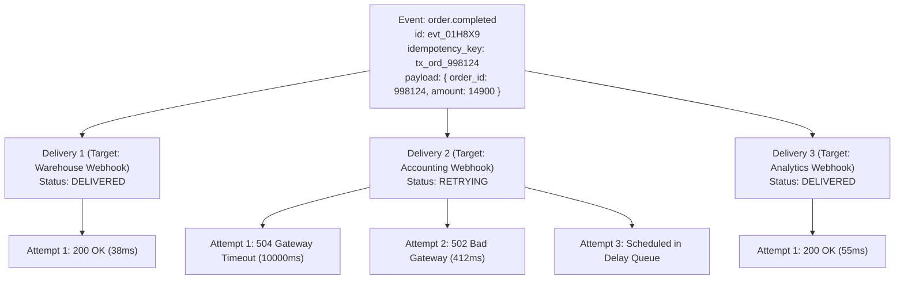
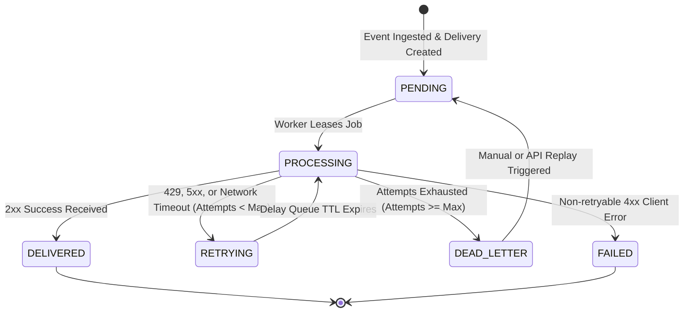

# Events vs. Deliveries

A common architectural flaw in homegrown webhook systems is treating an **Event** and a **Delivery** as the same entity. 

In real-world distributed architectures, one business event (e.g. `order.completed`) often needs to be routed to multiple independent receiver endpoints—such as an ERP system, a customer CRM, an analytics warehouse, and an internal audit logger.

Zyvan solves this by enforcing a strict, relational **1-to-N-to-M model**:

```text
Event (1)  ───►  Deliveries (N)  ───►  Attempts (M)
```

---

## The 1-to-N-to-M Entity Hierarchy



---

## 1. The Event (Ingestion Record)

An **Event** represents an immutable state change or occurrence within your system. Once ingested into Zyvan via `POST /v1/projects/:id/events`, the event record is immutable and permanently preserved.

### Event Schema Attributes

| Field | Type | Description |
| :--- | :--- | :--- |
| `id` | `string` | Unique prefixed identifier (e.g., `evt_01H8X9...`). |
| `project_id` | `string` | The parent project environment boundary (`prj_...`). |
| `tenant_id` | `string?` | Optional customer or account partition ID for concurrency caps. |
| `event_type` | `string` | Domain event identifier (e.g., `user.signup`, `invoice.paid`). |
| `idempotency_key` | `string` | Client-provided unique key enforced by a 24-hour database index. |
| `payload` | `JSON` | Arbitrary event data (up to 256KB). |
| `created_at` | `timestamp` | UTC timestamp of ingestion. |

---

## 2. The Delivery (Target Job)

When an event is committed, Zyvan's ingestion engine identifies all active **Destinations** configured to receive that event type. For each matching destination, Zyvan creates an independent **Delivery** record.

If a project has 4 matching destinations, 1 Event spawns **4 isolated Deliveries**.

### Why Delivery Isolation Matters

<Callout type="tip" title="Elimination of Destination Cross-Talk">
  Each Delivery maintains its own independent state machine and backoff schedule. If Destination B is down and timing out after 10 seconds, Destinations A, C, and D are dispatched immediately and delivered within milliseconds. Downstream receiver failures are strictly isolated.
</Callout>

### Delivery Lifecycle State Machine



### Delivery States

- <StatusBadge status="delivered" label="DELIVERED" />: Destination server responded with a `2xx` HTTP status code. The delivery is complete.
- <StatusBadge status="retrying" label="RETRYING" />: Request failed transiently (HTTP 429, 502, 503, 504, or network timeout). Scheduled in RabbitMQ delay queue.
- <StatusBadge status="queued" label="PENDING" />: Created and queued, waiting for an available worker thread.
- <StatusBadge status="processing" label="PROCESSING" />: Active HTTP request currently in flight.
- <StatusBadge status="dead_letter" label="DEAD_LETTER" />: All configured retry attempts were exhausted without success. Archived in the Dead-Letter Queue.
- <StatusBadge status="failed" label="FAILED" />: Non-retryable client error (e.g. 401 Unauthorized, 404 Not Found) or destination disabled.

---

## 3. The Attempt (Audit & Telemetry Log)

An **Attempt** represents a single physical HTTP request executed by a Zyvan delivery worker against the destination endpoint.

Every delivery contains 1 to $N$ attempt records.

### What is Recorded in Each Attempt?

<Steps>
  <Step number={1} title="Precise Latency & Timestamps">
    DNS lookup time, TCP handshake, TLS negotiation, and time-to-first-byte (TTFB) in milliseconds.
  </Step>

  <Step number={2} title="HTTP Status Codes & Network Errors">
    Exact status codes (e.g., `200`, `404`, `502`) or system-level error codes (`ECONNREFUSED`, `ETIMEDOUT`, `EAI_AGAIN`).
  </Step>

  <Step number={3} title="Outgoing Signatures & Headers">
    The exact `x-zyvan-signature` and `x-zyvan-timestamp` headers transmitted to your customer's receiver.
  </Step>

  <Step number={4} title="Truncated Downstream Response Body">
    Up to 2KB of the response body returned by the destination server to provide instant context during troubleshooting without unbounded database bloat.
  </Step>
</Steps>

---

## Code Example: Inspecting Event Deliveries via SDK

```typescript
import { ZyvanClient } from '@zyvan/sdk';

const zyvan = new ZyvanClient({
  apiKey: process.env.ZYVAN_API_KEY!,
  projectId: 'prj_live_01H8X92M4Q',
});

// Fetch all deliveries for a specific event
const { deliveries } = await zyvan.events.listDeliveries('evt_01H8X92M4Q');

for (const delivery of deliveries) {
  console.log(`Destination: ${delivery.destination_url}`);
  console.log(`Status: ${delivery.status} (Attempts: ${delivery.attempts_count})`);

  // Fetch attempt history for failed delivery
  if (delivery.status === 'DEAD_LETTER') {
    const { attempts } = await zyvan.deliveries.listAttempts(delivery.id);
    for (const attempt of attempts) {
      console.log(`  Attempt #${attempt.attempt_number}: ${attempt.status_code} (${attempt.latency_ms}ms)`);
      console.log(`  Error: ${attempt.error_message || attempt.response_body}`);
    }
  }
}
```
