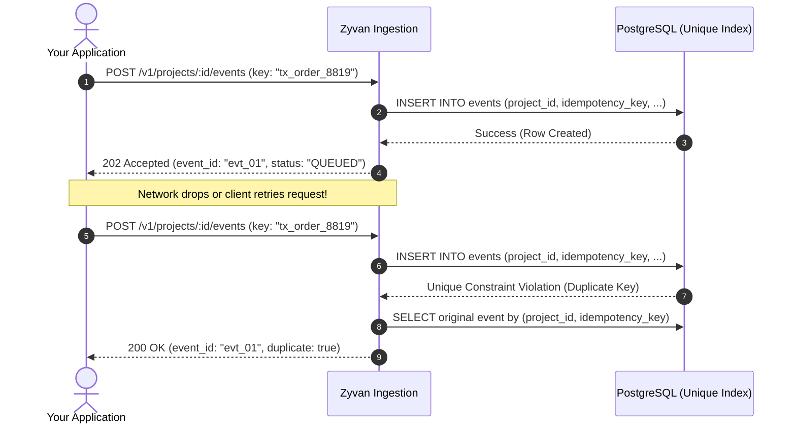

# Idempotency and Deduplication

In distributed systems, network partitions or client timeouts can cause your application to retry sending an event. Without idempotency protection, this causes duplicate events and repeated downstream actions (e.g., charging a card twice or double-shipping an order).

Zyvan provides **atomic, database-enforced deduplication** via the `idempotency_key` parameter.

---

## How Idempotency Works

---

## Best Practices for Idempotency Keys

<Steps>
  <Step number={1} title="Use Natural Domain Identifiers">
    Whenever possible, use business-level unique keys from your database (e.g., `checkout_session_id`, `invoice_id`, `user_uuid + action_name`).
  </Step>

  <Step number={2} title="Do Not Use Random UUIDs for Retries">
    If your HTTP client encounters a network timeout and retries, reuse the exact same `idempotency_key` so Zyvan can safely identify and deduplicate the retry.
  </Step>

  <Step number={3} title="24-Hour Deduplication Window">
    Idempotency keys are guaranteed unique within a rolling 24-hour window per project.
  </Step>
</Steps>

<Callout type="tip" title="Zero-Duplicate Guarantee">
  Even if 10 concurrent requests arrive simultaneously with the exact same `idempotency_key`, PostgreSQL transaction isolation guarantees that exactly **one** insert will succeed, and the remaining 9 will safely return the existing event.
</Callout>
