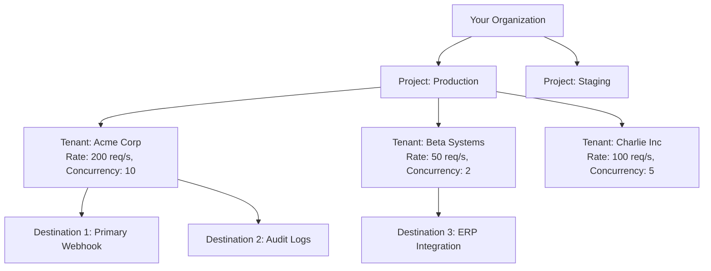

# Projects and Tenants

Zyvan is architected from the ground up to support high-throughput, multi-tenant B2B architectures.

---

## The Isolation Hierarchy



---

## 1. Projects (Primary Isolation Boundary)

A **Project** is the top-level boundary for:
- **API Keys & Authentication**: Keys are scoped to specific projects.
- **Environment Isolation**: Separate `production`, `staging`, and `development` environments into distinct projects.
- **Billing & Resource Quotas**: Overall throughput and storage quotas are tracked at the project level.

---

## 2. Tenants (Noisy Neighbor Protection)

A **Tenant** represents an individual customer, workspace, or account within your SaaS platform.

Why is tenant-level isolation critical?
<Callout type="warning" title="The Noisy Neighbor Vulnerability">
  If one high-volume customer experiences a sudden traffic spike or their destination endpoint crashes and blocks worker connections, a flat FIFO queue would starve all other customers of delivery capacity.
</Callout>

### Tenant Controls & Limits

Zyvan provides granular tenant-level controls:
- **Concurrency Limit**: Restricts the number of simultaneous HTTP requests in flight for a single tenant (e.g., maximum 10 parallel connections).
- **Rate Limit**: Token bucket rate limit per second (e.g., 200 req/s).
- **Pause / Resume**: Instantly pause webhook delivery for a misbehaving or compromised tenant without impacting other accounts.

```typescript
// Example: Configure Tenant Quotas
const tenant = await zyvan.tenants.update('tenant_acme_corp', {
  concurrencyLimit: 10,  // Max parallel deliveries
  rateLimit: 250,        // Max 250 req/sec
  status: 'ACTIVE'       // 'ACTIVE' | 'PAUSED'
});
```
