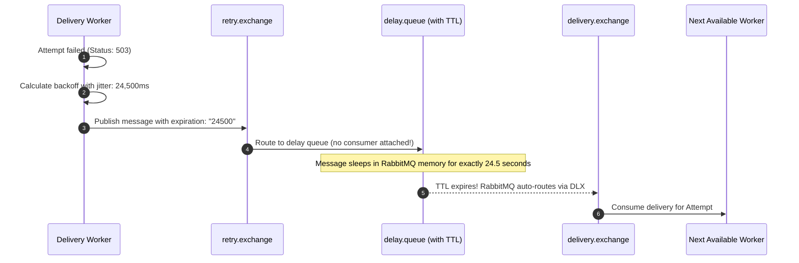

# Retries and Exponential Backoff

In production distributed systems, downstream webhook endpoints frequently experience transient failures: brief database connection spikes, rolling container deployments, temporary network routing flaps, or rate limiting.

If a webhook engine either abandons the delivery on first failure or immediately hammers the recovering server with rapid-fire retries, it either drops mission-critical data or drives the downstream server into catastrophic collapse.

Zyvan implements a resilient **Retry Engine** combining **exponential backoff with full jitter** and **RabbitMQ dead-letter delayed queues**.

---

## The Mathematical Model: Full Jitter Backoff

When an attempt fails due to a transient error, Zyvan calculates the delay before the next attempt using the **Full Jitter** algorithm (formulated by AWS Architecture Research):

$$
\text{BaseDelay}_i = \text{InitialInterval} \times (\text{Multiplier})^{i - 1}
$$

$$
\text{CappedDelay}_i = \min(\text{MaxInterval}, \text{BaseDelay}_i)
$$

$$
\text{ActualDelay}_i = \text{UniformRandom}(0, \text{CappedDelay}_i)
$$

Where:
- $i$ is the attempt number (e.g. $1, 2, \dots, N$)
- $\text{InitialInterval}$ is the base delay (default: 5 seconds)
- $\text{Multiplier}$ is the exponential scale factor (default: 2.0)
- $\text{MaxInterval}$ is the maximum delay cap (default: 86,400 seconds / 24 hours)

### Why Full Jitter is Essential

```mermaid
graph TD
    subgraph Without Jitter (Thundering Herd)
        A1[100 Failed Requests at T=0] --> B1[100 Retries at T=5s simultaneously!]
        B1 --> C1[Target Server Crashes Again!]
    end

    subgraph With Full Jitter (Desynchronized Spread)
        A2[100 Failed Requests at T=0] --> B2[Retries smoothly distributed between T=0s and T=5s]
        B2 --> C2[Target Server Recovers Gracefully]
    end
```

Without jitter, if a receiver experiences a momentary network hiccup affecting 500 webhooks at 12:00:00, all 500 webhooks retry simultaneously at 12:00:05, and again at 12:00:15—creating synchronized traffic spikes (the **Thundering Herd Problem**). Full jitter spreads retries evenly across time, giving the downstream server room to recover.

---

## Status Code Classification: What is Retried?

Zyvan evaluates downstream HTTP responses and network transport errors according to strict safety classifications:

| Response / Error | Classification | Behavior | Next State |
| :--- | :--- | :--- | :--- |
| **`200` – `299`** | Success | Delivery fulfilled | <StatusBadge status="delivered" label="DELIVERED" /> |
| **`429` Too Many Requests** | Transient Rate Limit | Respect `Retry-After` header or backoff | <StatusBadge status="retrying" label="RETRYING" /> |
| **`500` Internal Server Error** | Transient Server Error | Retry with exponential backoff | <StatusBadge status="retrying" label="RETRYING" /> |
| **`502` Bad Gateway** | Transient Infrastructure | Retry with exponential backoff | <StatusBadge status="retrying" label="RETRYING" /> |
| **`503` Service Unavailable** | Transient Outage | Respect `Retry-After` or backoff | <StatusBadge status="retrying" label="RETRYING" /> |
| **`504` Gateway Timeout** | Transient Timeout | Retry with exponential backoff | <StatusBadge status="retrying" label="RETRYING" /> |
| **`ETIMEDOUT` / `ECONNRESET`** | Network Drop | Retry with exponential backoff | <StatusBadge status="retrying" label="RETRYING" /> |
| **`400` Bad Request** | Terminal Client Error | Permanent payload rejection | <StatusBadge status="failed" label="FAILED" /> |
| **`401` Unauthorized** | Terminal Auth Error | Secret or credential invalid | <StatusBadge status="failed" label="FAILED" /> |
| **`403` Forbidden** | Terminal Auth Error | Access denied | <StatusBadge status="failed" label="FAILED" /> |
| **`404` Not Found** | Terminal Routing Error | Endpoint does not exist | <StatusBadge status="failed" label="FAILED" /> |
| **`410` Gone** | Terminal Resource Error | Endpoint permanently removed | <StatusBadge status="failed" label="FAILED" /> |

<Callout type="warning" title="Terminal Errors Do Not Waste Resources">
  If a destination responds with `404 Not Found` or `401 Unauthorized`, retrying will not resolve the issue without human intervention. Zyvan marks the delivery as `FAILED` immediately rather than wasting worker capacity on pointless attempts.
</Callout>

---

## Delay Queue Architecture: RabbitMQ TTL + DLX

Many engineering teams schedule retries using database polling:

```sql
-- The Naive Anti-Pattern (Degrades at Scale)
SELECT * FROM deliveries 
WHERE status = 'RETRYING' AND next_retry_at <= NOW() 
FOR UPDATE SKIP LOCKED LIMIT 100;
```

This anti-pattern suffers from severe database CPU churn, indexing overhead, lock contention, and high delivery latency.

Zyvan achieves **$O(1)$ constant-time delay scheduling** using **RabbitMQ message Time-To-Live (TTL) and Dead-Letter Exchanges (DLX)**:



### Architectural Advantages:
1. **Zero Database Polling**: The database is never queried in a loop to check if a delivery is ready to retry.
2. **Sub-Millisecond Accuracy**: The moment the TTL expires, RabbitMQ immediately transfers the message to the active delivery queue.
3. **Infinite Horizontal Scalability**: Millions of delayed deliveries can sit in broker storage without degrading database performance.

---

## Configuring Destination Retry Policies

You can customize retry limits and timing for each registered destination:

```typescript
import { ZyvanClient } from '@zyvan/sdk';

const zyvan = new ZyvanClient({
  apiKey: process.env.ZYVAN_API_KEY!,
  projectId: 'prj_live_01H8X92M4Q',
});

// Configure destination with aggressive retry policy
const destination = await zyvan.destinations.create({
  url: 'https://api.merchant.com/webhooks/orders',
  retryPolicy: {
    maxAttempts: 8,           // Allow up to 8 attempts before DLQ
    initialIntervalSec: 5,    // First retry within ~5 seconds
    backoffMultiplier: 2.0,   // Double delay each tier
    maxIntervalSec: 21600,    // Max 6 hours between late retries
  },
});
```
