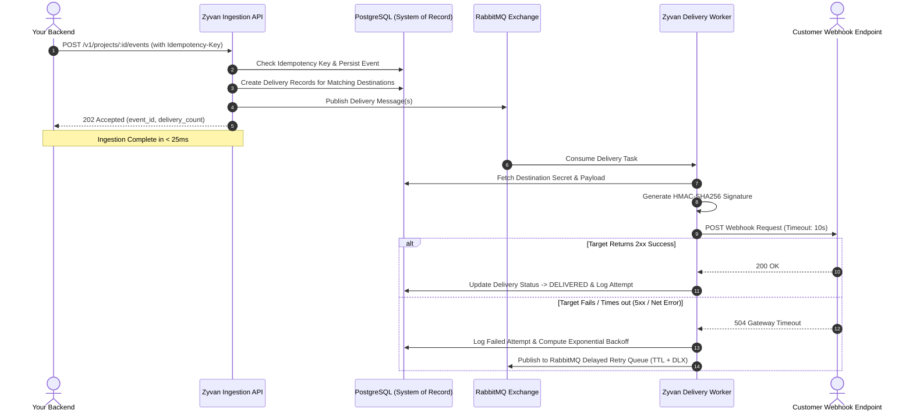

# How Zyvan Works

Zyvan is built upon a fundamental architectural axiom: **decoupling event ingestion from event delivery**.

By separating the **Ingestion Plane** (fast, synchronous, durable) from the **Delivery Plane** (asynchronous, rate-limited, fault-tolerant), Zyvan ensures that your application never blocks on downstream endpoint availability.

---

## The Dual-Plane Architecture

---

## Architectural Guarantees

### 1. PostgreSQL as the Single Source of Truth
While message brokers (RabbitMQ) provide fast scheduling, **PostgreSQL is the definitive source of truth**. Every event, destination configuration, delivery job, and individual attempt log is committed to PostgreSQL before any message is queued. If a worker process or queue node restarts, no state is lost.

### 2. RabbitMQ Delayed Retry with TTL + DLX
Unlike naive cron jobs that scan database tables with expensive `SELECT ... WHERE next_retry <= NOW()` queries (which lock rows and degrade under scale), Zyvan uses **RabbitMQ Dead Letter Exchanges (DLX)** and per-message **Time-To-Live (TTL)**.
- A retry message is pushed to a delay queue with an exact TTL (e.g., 10s, 30s, 120s).
- When the TTL expires, RabbitMQ automatically dead-letters the message back to the active delivery exchange.
- This results in $O(1)$ constant time scheduling with zero database polling overhead.

<Callout type="note" title="Retry Exhaustion & DLQ">
  If a destination fails all configured retry attempts (e.g., 5 attempts over 2 hours), the delivery is marked as `DEAD_LETTER` and safely archived. You can inspect the complete HTTP error log, resolve the downstream issue, and trigger an atomic replay with zero risk of duplicate execution.
</Callout>
