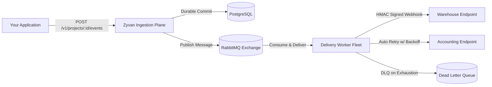

# Welcome to Zyvan

**Zyvan** is a production-grade webhook and event delivery infrastructure platform engineered to solve the hardest problems of distributed event delivery: **durable ingestion**, **at-least-once delivery guarantees**, **cryptographic signature verification**, **exponential backoff retries with full jitter**, and **zero-overwrite Dead Letter Queue (DLQ) recovery**.

<Callout type="tip" title="Why Zyvan?">
  Building custom webhook dispatch loops inside web apps inevitably leads to dropped events, thread blocking, unhandled server timeouts, and accidental duplicate processing. Zyvan decouples ingestion from delivery with PostgreSQL durability and RabbitMQ asynchronous queues.
</Callout>

---

## What Problem Does Zyvan Solve?

Imagine you run an e-commerce or SaaS platform. When a customer completes a checkout or subscription, your backend needs to broadcast webhooks to external services:
1. **Warehouse / ERP** to trigger fulfillment.
2. **Accounting / Billing** to generate an invoice.
3. **CRM / Analytics** to update customer profiles.

In production environments:
- External endpoints experience transient downtime or deployment restarts (`502 Bad Gateway`, `504 Gateway Timeout`).
- Network requests drop silently.
- Slower endpoints can bottleneck your application workers.
- Naive retry loops can cause **thundering herds** or double-charge customers.

Zyvan eliminates all of this complexity with a resilient multi-tenant delivery engine.

---

## Core Capabilities

<CardGroup cols={2}>
  <Card title="Durable Event Ingestion" href="/docs/architecture/ingestion-pipeline" icon="zap" badge="< 25ms">
    Accepts events immediately with PostgreSQL transactional guarantees and assigns unique delivery jobs before queueing.
  </Card>
  <Card title="Cryptographic HMAC-SHA256" href="/docs/webhooks/signing-hmac-sha256" icon="shield" badge="Security">
    Every outgoing webhook payload is signed with a secret key and timestamp header to prevent replay attacks and tampering.
  </Card>
  <Card title="Delayed Retries & Jitter" href="/docs/webhooks/retry-exponential-backoff" icon="retry" badge="RabbitMQ TTL+DLX">
    Uses RabbitMQ dead-letter routing to provide accurate, non-blocking exponential backoff with full jitter across retry tiers.
  </Card>
  <Card title="Dead Letter Queue & Replay" href="/docs/guides/replay-failed-events" icon="layers" badge="Zero Overwrite">
    Permanently failed deliveries are archived in the DLQ with full attempt histories and can be safely replayed at any time.
  </Card>
</CardGroup>

---

## Ready to Get Started?

Follow our 5-minute quickstart guide to send your first event:

<CardGroup cols={1}>
  <Card title="Jump to Quickstart (5 Minutes)" href="/docs/getting-started/quickstart" icon="terminal" badge="Recommended">
    Create your project, generate an API key, register a webhook destination, and dispatch an authenticated event.
  </Card>
</CardGroup>
