# Handle Retries & Exponential Backoff

When your destination server returns a transient error (e.g. `500 Internal Server Error`, `502 Bad Gateway`, `503 Service Unavailable`, `504 Gateway Timeout`) or experiences a connection timeout, Zyvan initiates **exponential backoff retries**.

---

## When Does Zyvan Retry?

| HTTP Status / Condition | Action | Rationale |
| :--- | :--- | :--- |
| **`200` - `299`** | **Success** | Webhook accepted and processed. |
| **`400` - `499`** (except `429`) | **Permanent Failure** | Client/syntax error (e.g. `404 Not Found`). Moved directly to DLQ. |
| **`429 Too Many Requests`** | **Retry** | Target endpoint is rate limited; backed off. |
| **`500` - `599`** | **Retry** | Target server crash or transient gateway failure. |
| **Connection Timeout** | **Retry** | Endpoint took $> 10$ seconds to respond. |

---

## Retry Schedule Simulation

With default settings (`initial_interval: 5s`, `multiplier: 2`, `max_attempts: 5`):

```mermaid
gantt
    title Typical Retry Progression (with Jitter)
    dateFormat  s
    axisFormat  %S s
    section Attempt 1
    Initial Dispatch (Fail 503) :0, 1s
    section Attempt 2
    Wait ~5s & Retry            :5, 6s
    section Attempt 3
    Wait ~10s & Retry           :15, 16s
    section Attempt 4
    Wait ~20s & Retry           :35, 36s
    section Attempt 5 (Final)
    Wait ~40s & Retry           :75, 76s
```

