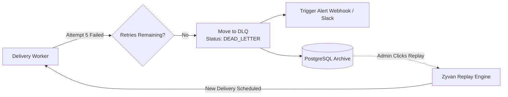

# Dead Letter Queue (DLQ)

When a webhook fails to deliver after all configured retry attempts have been exhausted, Zyvan moves the delivery to the **Dead Letter Queue (DLQ)**.

---

## Why a Dedicated DLQ?

- **Zero Data Loss**: Failed payloads are preserved in PostgreSQL indefinitely with their entire attempt log history.
- **Worker De-congestion**: Prevents broken endpoints from cycling through worker queues indefinitely.
- **Granular Recovery**: Replay individual failed deliveries or execute bulk replays after fixing downstream issues.

<Callout type="tip" title="DLQ Alerting">
  You can configure a Slack webhook or email notification in your Zyvan project settings to receive instant alerts whenever a delivery lands in the Dead Letter Queue.
</Callout>
