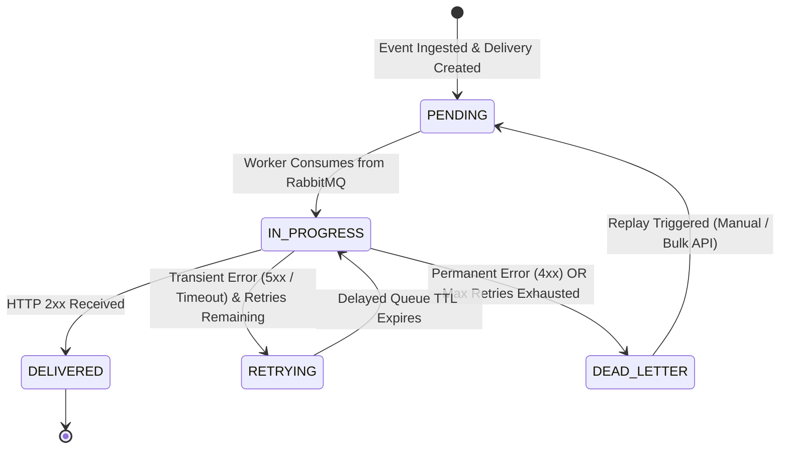

# Webhook Lifecycle & State Machine

Every delivery job follows a deterministic state machine throughout its lifecycle.

---

## State Transition Diagram

---

## Delivery States Reference

| State | Description | Next Possible States |
| :--- | :--- | :--- |
| `PENDING` | Delivery record created in PostgreSQL; task published to queue. | `IN_PROGRESS` |
| `IN_PROGRESS` | Worker has claimed the task and dispatched the HTTP request. | `DELIVERED`, `RETRYING`, `DEAD_LETTER` |
| `DELIVERED` | Target returned a `2xx` HTTP status code. Delivery complete. | Terminal state |
| `RETRYING` | Delivery failed transiently; sitting in RabbitMQ delayed TTL queue. | `IN_PROGRESS` |
| `DEAD_LETTER` | All retries exhausted or non-retryable error received. | `PENDING` (via Replay) |
