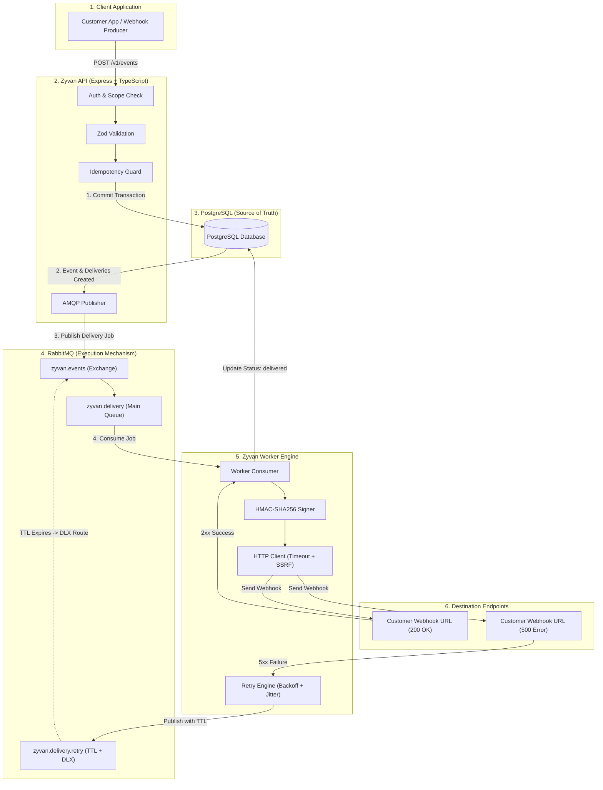
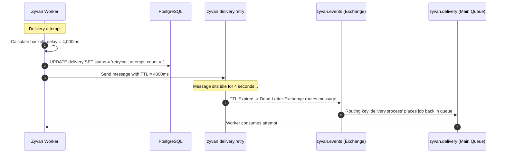

# Zyvan — System Architecture

This document explains how Zyvan is structured, how data flows through the system, and how high reliability is achieved even when networks and destination servers fail.

---

## 1. High-Level Architecture Overview

Zyvan is divided into two decoupled processes:
1. **API Server (`apps/api`)**: Responsible for fast, synchronous acceptance of events. It validates, deduplicates, persists to database, enqueues to RabbitMQ, and returns `202 Accepted` immediately (under 20ms).
2. **Worker Daemon (`apps/worker`)**: Responsible for asynchronous execution. It consumes delivery jobs from RabbitMQ, decrypts secrets, generates HMAC signatures, sends HTTP POST requests, records attempt history, and handles retries or DLQ transitions.



---

## 2. Core Architectural Principles

### Principle 1: PostgreSQL is the System of Record; RabbitMQ is the Execution Mechanism
- **The database is always written first.** Zyvan will never acknowledge an event (`202 Accepted`) to the user unless the event and delivery records have been committed to PostgreSQL.
- If RabbitMQ goes down after a database commit, no event is ever lost — the delivery remains in `queued` state in PostgreSQL and can be reconciled.
- The queue job payload only carries lightweight IDs: `{ deliveryId, eventId }`. The worker loads fresh state from PostgreSQL, ensuring all checks reflect the latest configuration (e.g., if a destination was paused while the job was in transit).

### Principle 2: Idempotency is Enforced at the Database Level
- Instead of relying on in-memory caches or Redis keys that might expire or get lost during restarts, Zyvan enforces uniqueness with a composite database constraint:
  ```sql
  UNIQUE(project_id, idempotency_key)
  ```
- If a client resends the same event due to a network glitch, the database blocks duplicate insertion and Zyvan safely returns the existing event record with `200 OK` (deduplicated).

### Principle 3: Attempt History is Strictly Immutable
- An **Attempt** represents a physical HTTP call made to the outside world.
- When an event is retried or replayed, historical attempts are **never updated or deleted**. New attempts are appended. This allows engineers to reconstruct the exact timeline of what happened during an incident.

---

## 3. RabbitMQ Delayed Retry Architecture (TTL + DLX)

Instead of running slow background cron jobs that poll the database every second (`SELECT * FROM deliveries WHERE next_retry_at <= NOW()`), Zyvan uses native RabbitMQ primitives for sub-second precision and zero polling overhead.

### How It Works:
1. When a delivery encounters a transient failure (e.g., HTTP 500 or timeout), the **Retry Service** calculates an exponential backoff delay with jitter (e.g., 4,250 ms).
2. The worker marks the delivery as `status: 'retrying'` and publishes the job to `zyvan.delivery.retry` with a per-message TTL (`expiration: "4250"`).
3. The message sits in the retry queue until the timer expires. No worker consumes from this queue.
4. When the TTL expires, RabbitMQ automatically dead-letters the message to the Dead-Letter Exchange (`zyvan.events`) with routing key `delivery.process`.
5. The message lands back in `zyvan.delivery`, where an available worker picks it up for the next attempt.



---

## 4. Multi-Tenant Isolation

A project can have hundreds of independent tenants (e.g., Tenant A = Shopify Store 1, Tenant B = Shopify Store 2).

Without multi-tenant protection, a spike of 10,000 events from Tenant A could saturate all worker capacity, starving Tenant B. Zyvan prevents this through:
- **Tenant Concurrency Limits**: The maximum number of simultaneous HTTP delivery connections allowed per tenant.
- **Tenant Rate Limits**: The maximum events/second allowed per tenant.
- **Destination Rate Limits**: Outbound limits to prevent overwhelming destination servers.
- **Status Pausing**: Individual tenants or destinations can be paused (`status = 'paused'`) without dropping queued work. Messages wait safely until resumed.
