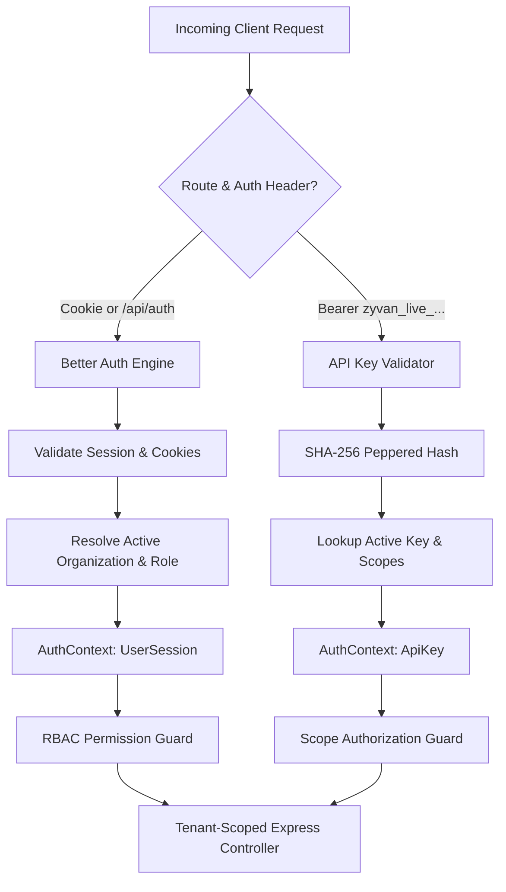

# Zyvan Authentication & Multi-Tenant Architecture

Zyvan provides resilient, high-throughput webhook delivery infrastructure designed for multi-tenant SaaS environments. This document details the end-to-end authentication, authorization, and tenant isolation architecture.

---

## 1. System Overview & Tenant Isolation Model

Zyvan enforces a strict **Organization = Tenant Boundary** model. All domain entities, configuration records, secrets, and event streaming pipelines are partitioned by `organizationId`.

```
┌─────────────────────────────────────────────────────────────────────────────┐
│                            Organization (Tenant)                            │
│  id: "org_01J98FA..."                                                       │
│  slug: "acme-corp"                                                          │
│                                                                             │
│  ┌──────────────────────┐  ┌──────────────────────┐  ┌───────────────────┐ │
│  │       Members        │  │     API Keys         │  │     Projects      │ │
│  │ (User + Role)        │  │ (zyvan_live_...)     │  │ (prod, staging)   │ │
│  └──────────────────────┘  └──────────────────────┘  └─────────┬─────────┘ │
│                                                                │           │
│  ┌─────────────────────────────────────────────────────────────▼─────────┐ │
│  │ Destinations (Webhooks) │ Events & Ingestion │ Deliveries & Retries   │ │
│  │ DLQ Records             │ Replay Lineage     │ Audit Logs             │ │
│  └───────────────────────────────────────────────────────────────────────┘ │
└─────────────────────────────────────────────────────────────────────────────┘
```

### Core Tenets:
1. **Zero Cross-Tenant Leakage**: Every query and mutation in the persistence layer filters by `organizationId`. There are no global or cross-tenant joins without explicit organization qualification.
2. **Explicit Active Tenant Context**: Interactive user sessions must specify or default to an active organization membership. Machine API keys are cryptographically bound to a single organization.
3. **Defense-in-Depth**: Express routing guards (`requireAuth`, `requireSession`, `requirePermission`) enforce RBAC before request execution; repositories enforce `organizationId` filtering at the SQL layer.

---

## 2. Dual-Authentication Architecture

Zyvan separates interactive developer traffic (Dashboard/UI) from automated machine traffic (Event Ingestion/SDK):



### A. Interactive User Sessions (Better Auth)
- **Framework**: [Better Auth](https://better-auth.com) with Prisma adapter mounted directly into Express via `toNodeHandler(auth)`.
- **Supported Auth Strategies**:
  1. **Email & Password**: Argon2/Bcrypt password hashing with salting.
  2. **Google OAuth 2.0**: Direct integration via Google OAuth credentials.
  3. **GitHub OAuth**: Direct integration via GitHub OAuth app credentials.
- **Session Transport**: HTTP-only, `SameSite=Lax`, secure cookies.
- **Tenant Management**: Better Auth `organization` plugin providing organizations, memberships, invitations, and active tenant switching.

### B. Machine API Keys (Event Ingestion & CLI)
- **Key Format**: `zyvan_live_<24-hex-entropy>` or `zyvan_test_<24-hex-entropy>`.
- **Storage**: Keys are never stored in plaintext. Zyvan stores `keyHash = SHA-256(pepper + rawKey)` along with a safe prefix (`zyvan_live_e891c...`) for display in the dashboard.
- **Revocation**: Soft-deletion with `revokedAt` timestamp. Revoked keys are rejected in $O(1)$ constant time.
- **Granular Scopes**:
  - `events:write`: Publish events to Zyvan ingestion queues.
  - `events:read`: Inspect event lifecycle and delivery attempts.
  - `destinations:manage`: Register and configure webhook endpoints.
  - `destinations:read`: View destination health and metrics.
  - `replay:execute`: Trigger replay of dead-lettered webhooks.

---

## 3. Request Lifecycle & Pipeline

```
1. Incoming HTTP Request
   │
   ├── 2. Helmet & CORS Middleware (origin verification, credentials: true)
   │
   ├── 3. Request-ID Middleware (assigns or propagates X-Request-Id UUID)
   │
   ├── 4. Authentication Middleware (`authenticate` / `requireAuth`)
   │      ├── Check Better Auth cookie or Authorization Bearer header
   │      └── Populate `req.auth`, `req.currentUser`, `req.organization`
   │
   ├── 5. Authorization Guard (`requirePermission(Resource, Action)`)
   │      ├── Compare role against Centralized RBAC Matrix
   │      └── Return 403 Forbidden on privilege deficit
   │
   ├── 6. Zod Schema Validation (input sanitization & type coercion)
   │
   ├── 7. Tenant-Scoped Service & Repository Execution
   │      └── Every Prisma call includes `{ where: { organizationId } }`
   │
   └── 8. Structured Pino Audit Logging
```

---

## 4. Cryptographic Security & Secrets

### A. Webhook Signature Generation (HMAC SHA-256)
Outgoing webhook payloads are signed using HMAC-SHA256 according to the standard timestamped signature scheme:
$$\text{Signature} = \text{HMAC-SHA256}\left(\text{signingSecret}, t + "." + \text{rawBody}\right)$$
Sent via header:
```http
Zyvan-Signature: t=1710928100,v1=9b3a4f...
```
Receivers can verify payloads using the zero-dependency helper in `@zyvan/sdk`:
```typescript
import { verifyWebhookSignature } from '@zyvan/sdk';

const isValid = verifyWebhookSignature({
  payload: rawBodyString,
  signatureHeader: req.headers['zyvan-signature'],
  secret: process.env.ZYVAN_WEBHOOK_SECRET,
  toleranceSeconds: 300, // 5-minute replay window
});
```

### B. Secret Storage (AES-256-GCM Envelope Encryption)
Webhook signing secrets are encrypted at rest using AES-256-GCM with authenticated tags:
$$\text{Ciphertext} = \text{AES-256-GCM}(\text{Secret}, \text{MasterKey}, \text{IV})$$
Format: `v1:<iv_hex>:<tag_hex>:<ciphertext_hex>`.

### C. SSRF Protection
Destination endpoints undergo strict asynchronous SSRF validation before registration and dispatch:
- DNS pre-resolution to prevent DNS rebinding.
- Rejection of private IPv4 (`10.0.0.0/8`, `172.16.0.0/12`, `192.168.0.0/16`, `127.0.0.0/8`, `169.254.0.0/16`) and IPv6 loopback/link-local ranges.
- HTTPS enforcement in production environments.
