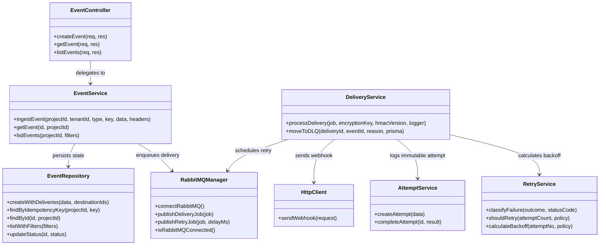
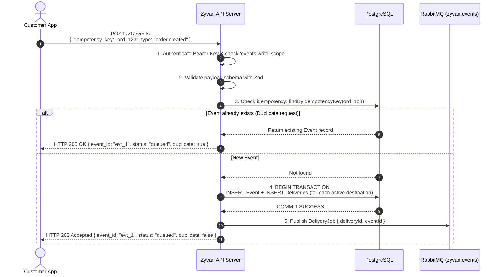
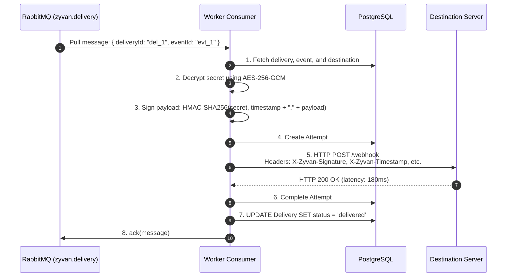
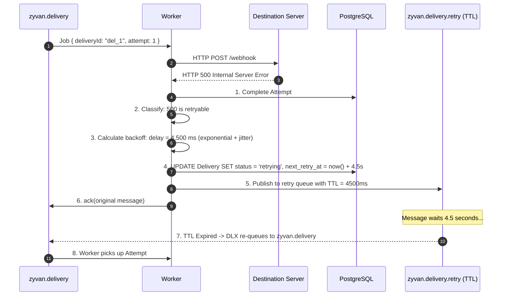
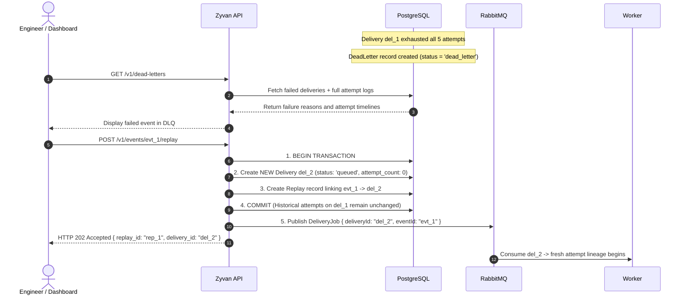

# Zyvan — Class & Sequence Diagrams

This document illustrates the module dependencies and step-by-step lifecycles of events in Zyvan using UML and Mermaid sequence diagrams.

---

## 1. Class & Module Architecture

Zyvan follows a modular, layer-separated architecture:
- **Controllers**: Parse HTTP requests and invoke services.
- **Services**: Contain pure business logic (SSRF, idempotency, retry, signing).
- **Repositories**: Encapsulate Prisma database access.
- **Queue/Client Libraries**: Handle RabbitMQ and external HTTP communication.

---

## 2. Sequence Diagram 1: Event Ingestion & Idempotency Pipeline

When an application calls `POST /v1/events`:
1. The API checks the bearer token and permissions.
2. The idempotency key is checked against the database.
3. If duplicate: returns the existing event with `200 OK` (no new job is queued).
4. If new: commits the event and delivery records in an atomic PostgreSQL transaction.
5. Publishes delivery jobs to RabbitMQ.
6. Returns `202 Accepted` to the caller.

---

## 3. Sequence Diagram 2: Worker Webhook Delivery & Attempt Tracking

When an event is ready for delivery:
1. The worker pulls the delivery job from RabbitMQ.
2. It fetches the event payload and destination details from PostgreSQL.
3. Decrypts the destination's signing secret using AES-256-GCM.
4. Computes an HMAC-SHA256 signature and attaches `X-Zyvan-*` headers.
5. Starts an immutable `Attempt` record in the database.
6. Sends the HTTP POST request to the customer destination.
7. On `2xx Success`: completes the attempt record, marks the delivery as `delivered`, and acknowledges the message in RabbitMQ.

---

## 4. Sequence Diagram 3: Transient Failure & Delayed Retry Flow

When a destination returns HTTP 500 or times out:
1. The failure is classified as **retryable**.
2. Exponential backoff with random jitter is calculated.
3. The delivery status is updated to `retrying` with `next_retry_at`.
4. The job is published to `zyvan.delivery.retry` with a per-message TTL.
5. When the TTL expires, RabbitMQ automatically routes the job back to `zyvan.delivery` via the Dead-Letter Exchange.
6. The worker picks it up for the next attempt.

---

## 5. Sequence Diagram 4: Dead Letter Queue (DLQ) & Safe Replay

When all retries are exhausted (or a 4xx terminal error occurs):
1. The delivery enters the **Dead Letter Queue (DLQ)**.
2. An engineer inspects the failed event and attempts via the Zyvan dashboard or API.
3. The engineer calls `POST /v1/events/:id/replay`.
4. Zyvan creates a **new** Delivery and a linked Replay record.
5. The original attempt history is untouched.
6. The new delivery job is enqueued to RabbitMQ for execution.

