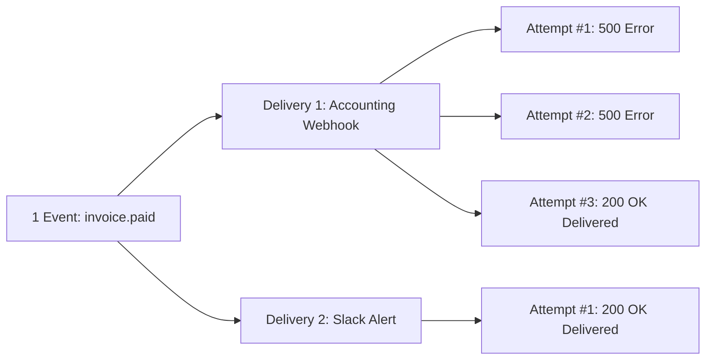
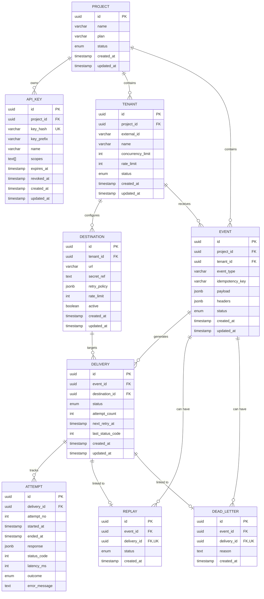

# Zyvan — Entity-Relationship (ER) & Database Design

Zyvan uses **PostgreSQL** as the single source of truth for all configuration and operational state.

---

## 1. Core Model Concept: Event vs. Delivery vs. Attempt

Understanding these three entities is essential to understanding Zyvan:

1. **Event**: The logical occurrence emitted by the customer application (e.g., `invoice.paid`). Stored once.
2. **Delivery**: The intent to deliver an Event to a specific **Destination**. If a tenant has 3 destinations configured, 1 Event produces 3 independent Delivery records.
3. **Attempt**: The physical HTTP call made to a destination server. If Delivery A fails twice and succeeds on the 3rd try, Delivery A has 3 immutable Attempt records.

---

## 2. Mermaid Entity-Relationship (ER) Diagram

---

## 3. Detailed Table Dictionary

### 3.1 `projects`
The primary multi-tenant security boundary. All API keys, tenants, destinations, and events belong to a project.

### 3.2 `api_keys`
Machine-to-machine authentication tokens.
- `key_hash`: SHA-256 HMAC hash with application pepper. The plaintext API key is never stored.
- `key_prefix`: Visible identifier (e.g., `zyvan_live_abc1`) to identify keys without revealing the secret.
- `scopes`: Array of granular permissions (`events:write`, `events:read`, `destinations:manage`, etc.).

### 3.3 `tenants`
Tenant entities enable noisy-neighbor isolation within a project.
- Composite uniqueness: `UNIQUE(project_id, external_id)`.
- `concurrency_limit`: Maximum parallel active deliveries allowed.
- `rate_limit`: Maximum accepted events per second.

### 3.4 `destinations`
Endpoints where webhooks are delivered.
- `url`: The target webhook address (validated against SSRF).
- `secret_ref`: The signing secret, encrypted with AES-256-GCM.
- `retry_policy`: JSON configuring `{ maxAttempts, baseDelay, maxDelay }`.
- `active`: Boolean allowing instant pause/resume without deleting queued items.

### 3.5 `events`
Accepted webhook events.
- Composite uniqueness: `UNIQUE(project_id, idempotency_key)`. This is the database-level lock preventing duplicate events.
- `status`: `queued` | `delivering` | `retrying` | `delivered` | `dead_letter` | `expired` | `cancelled`.

### 3.6 `deliveries`
Each target endpoint for an event gets a delivery record.
- `attempt_count`: Counter incremented before each attempt.
- `next_retry_at`: Scheduled timestamp for the next attempt.
- `status`: `queued` | `delivering` | `retrying` | `delivered` | `failed` | `cancelled`.

### 3.7 `attempts`
Immutable audit log of all outbound HTTP calls.
- `latency_ms`: Response time in milliseconds.
- `outcome`: `success` | `failed` | `timeout` | `error`.
- `response`: Truncated response body (up to 4KB) for debugging.

### 3.8 `replays`
Records manual or automated replays. Linked 1-to-1 with the **new** Delivery created for the replay lineage.

### 3.9 `dead_letters`
Deliveries whose retries have been exhausted or failed with terminal errors. Complete attempt history remains attached to the delivery.
